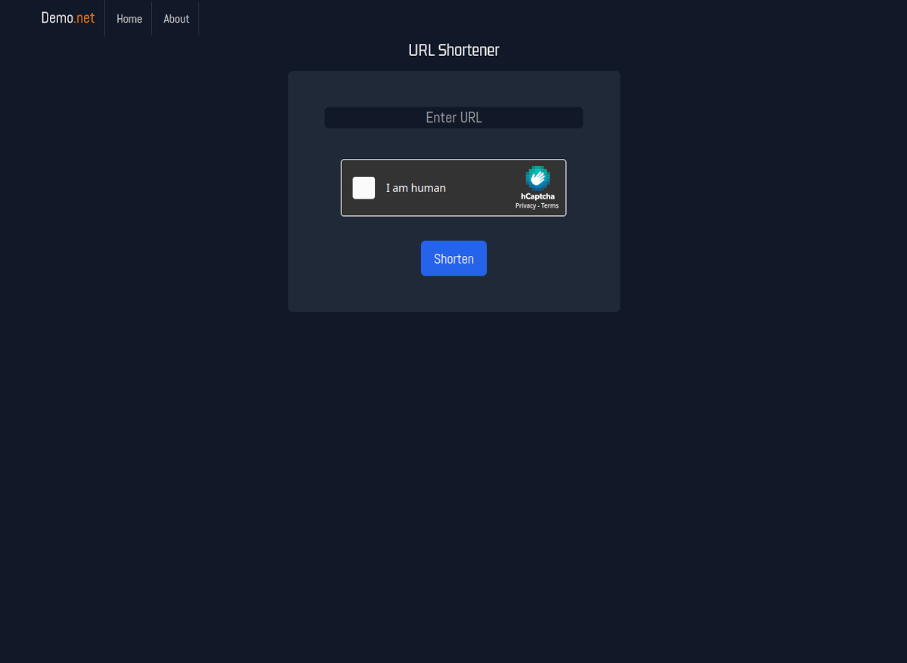

# flask-url-shortener
A simple URL shortener made with Flask + SQLite. hCaptcha integrated to reduce spam.

To use locally, first set environment variables for your hCaptcha keys:

`export HCAPTCHA_SECRET=xxxxxxxxxxxxxxxxxxxxxxxxxxx`

`export HCAPTCHA_SITEKEY=xxxxxxxx-xxxx-xxxx-xxxx-xxxxxxxxxxxx`

In app.py, set `SERVERN = yourdomain.com`. This is the domain it will use to create the shortlinks; on localhost use `localhost:5000`.

Then run the app `python3 app.py` and point your browser to localhost:5000. It will create a SQLite database named links.db

To-do:

- Better validation+sanitization for input
- Create feature to add an advertisement to shortlinks before redirecting, a la adfly
- Edit templates to use semantic HTML tags wherever relevant
- Create some themes in the form of CSS stylesheets
- Login?
